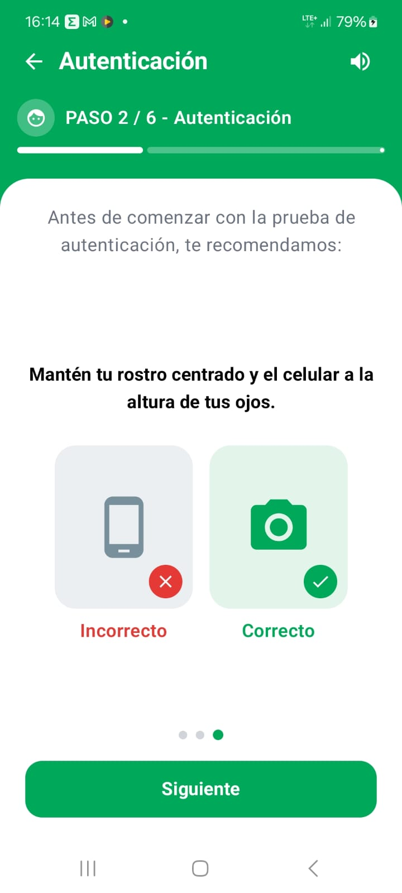
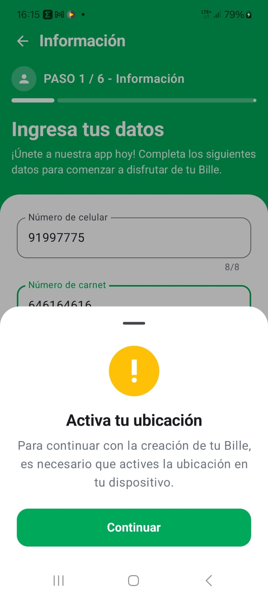
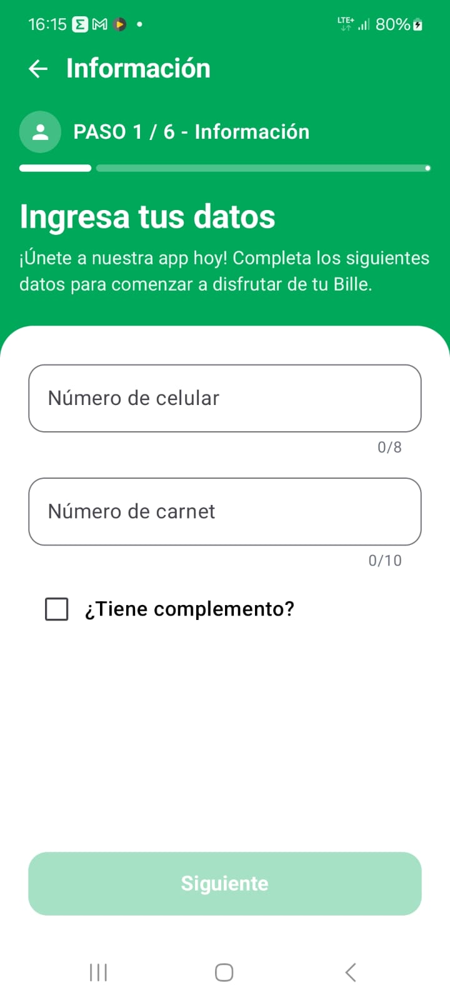
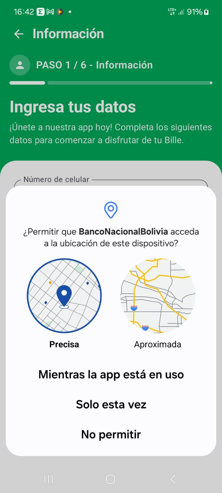

# 📱 Bille - Onboarding & Verificación de Identidad

Aplicación móvil desarrollada en **Android con Kotlin y Jetpack Compose**, inspirada en el flujo de registro y verificación digital de la billetera móvil **Bille**. La aplicación implementa una arquitectura robusta **MVVM**, validación de entradas de usuario en tiempo real y gestión reactiva de permisos de hardware en tiempo de ejecución.

---

## 📸 Capturas de Pantalla

| Paso 1: Datos Personales | Paso 1: Con Complemento | Bottom Sheet: Ubicación | Diálogo de Permisos | Paso 2: Autenticación |
| :---: | :---: | :---: | :---: | :---: |
|  |  |  |  |

> **Nota:** Guarda tus imágenes dentro de una carpeta llamada `screenshots/` en la raíz del repositorio con los nombres indicados arriba (o actualiza las rutas según corresponda).

---

## 🚀 Características Principales

- **Validación de Entradas en Tiempo Real (MVVM):**
  - **Número de celular:** Longitud máxima de 8 dígitos, únicamente numérico.
  - **Número de carnet (CI):** Longitud máxima de 10 dígitos, únicamente numérico.
  - **Complemento:** Opcional mediante checkbox; longitud máxima de 2 caracteres, alfanumérico estricto (sin espacios ni caracteres especiales).
  - **Habilitación dinámica:** El botón principal solo se activa cuando se cumplen las reglas de validación obligatorias.
- **Manejo Dinámico de Permisos de Ubicación:**
  - Validación de estado de `ACCESS_FINE_LOCATION` y `ACCESS_COARSE_LOCATION` previo al consumo de la API/servicio.
  - Hoja modal interactiva (`ModalBottomSheet`) con feedback visual que orienta al usuario para activar su ubicación.
  - Disparo reactivo del launcher del sistema (`ActivityResultContracts.RequestMultiplePermissions`).

- **Diseño Moderno:** Interfaz basada en componentes de **Material 3**, barras de progreso adaptables y estructura limpia de layouts.

---

## 🛠️ Tecnologías y Dependencias

- **Lenguaje:** [Kotlin](https://kotlinlang.org/)
- **UI Framework:** [Jetpack Compose](https://developer.android.com/jetpack/compose) (Material 3)
- **Arquitectura:** MVVM (Model-View-ViewModel) + Unidirectional Data Flow (UDF)
- **Gestión de Estado:** `StateFlow` y `SharedFlow` (Coroutines)
- **Permisos:** Activity Result API (`rememberLauncherForActivityResult`)
- **Herramienta de compilación:** Gradle (Kotlin DSL)

---

## 📂 Estructura del Proyecto

```text
app/src/main/java/com/example/billeapp/
├── data/
│   └── model/              # Modelos de datos para el registro
├── ui/
│   ├── components/         # Modales, diálogos y campos de texto personalizados
│   ├── screens/            # Pantallas (Paso 1: Información, Paso 2: Autenticación)
│   └── theme/              # Paleta de colores, tipografías y formas Material3
├── util/
│   └── PermissionUtils.kt  # Helpers para validación de permisos
└── viewmodel/
    ├── RegistrationState.kt# UiState y UiEvents
    └── RegistrationViewModel.kt # Lógica de validación y control de flujo
